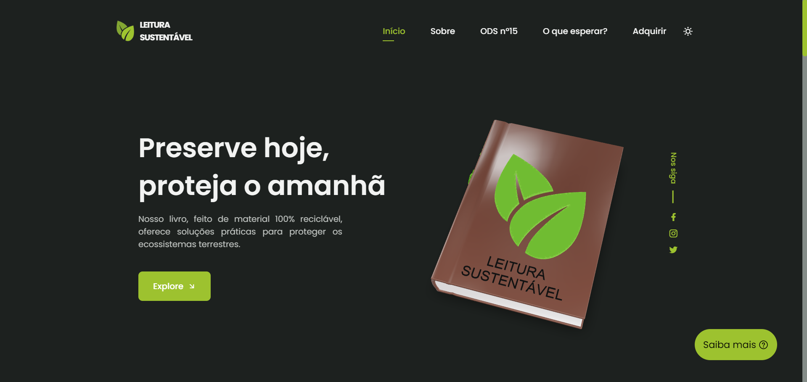

# Readme.Github

# Leitura Sustentável

## 📱Descrição do projeto

### Este projeto foi desenvolvido para o simpósio da Faculdade São Judas Unimonte.

### Trata-se de uma landing page interativa para promover a venda de um livro educativo feito 100% de papel kraft reciclável.

### O livro foi modelado em 3D utilizando Blender, proporcionando uma visualização realista e interativa para o usuário. 

### A landing page inclui diversas interatividades, como modo dark/light, cards com mouse tracking e um modal informativo.

## 🎯Objetivo do projeto

### Nosso objetivo foi propor uma forma de alcançar a ODS nº 15, promovendo a conscientização e a educação sobre a importância da conservação dos ecossistemas terrestres através de um livro educativo.

## 🔨Funcionalidades da aplicação web - RFs

- `Funcionalidade 1`: Alternância entre modo dark e light
- `Funcionalidade 2`: Modal informativo que abre ao clicar no botão “Saiba mais”
- `Funcionalidade 3`: Cards interativos com efeito de mouse tracking
- `Funcionalidade 4`: Formulário que, ao ser preenchido, redireciona o usuário para a página de compra do livro

## ✔️Tecnologias utilizadas

- `HTML`
- `CSS`
- `SCSS`
- `JavaScript`
- `Blender`

## 
📱Interface

